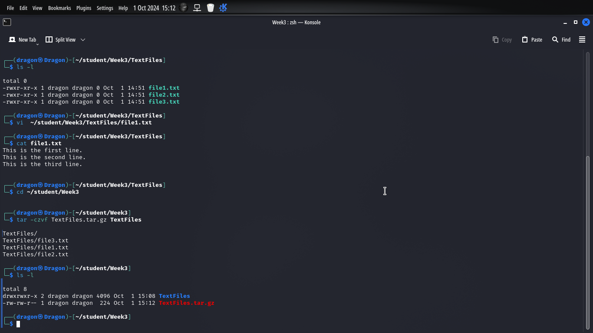

# **Task 1: Directory Structure Creation**

1.  **Create the Home Directory**:

    ``` bash
    mkdir -p ~/student
    ```

2.  **Create the Week2 and Week3 Directories**:

    ``` bash
    mkdir ~/student/Week2 ~/student/Week3
    ```

3.  **Create the Text Files in Week2**:

    ``` bash
    touch ~/student/Week2/file1.txt ~/student/Week2/file2.txt ~/student/Week2/file3.txt
    ```

4.  **Create the TextFiles Subdirectory in Week3**:

    ``` bash
    mkdir ~/student/Week3/TextFiles
    ```

5.  **Move the Text Files from Week2 to TextFiles**:

    ``` bash
    mv ~/student/Week2/*.txt ~/student/Week3/TextFiles/
    ```

6.  **Verify the Directory Structure**: You can list the directory structure using:

    ``` bash
    tree ~/student
    ```

    If you don't have `tree` installed, you can also use:

    ``` bash
    ls -R ~/student
    ```


# **Task 2: File Permissions**

1.  

    ``` bash
    cd ~/student/Week3/TextFiles
    ```

2.  

    ``` bash
    chmod 755 *.txt
    ```

3.  

    ``` bash
    ls -l
    ```

    

# T**ask 3: File Editing with nano or vi**

1.  

    ``` bash
    vi ~/student/Week3/TextFiles/file1.txt
    ```

2.  

    ```         
    This is the first line.
    This is the second line.
    This is the third line.
    ```

    ``` bash
    cat ~/student/Week3/TextFiles/file1.txt
    ```

### 


# 

# Task4 File compression

# 

``` bash
cd ~/student/Week3
```

``` bash
tar -czvf TextFiles.tar.gz TextFiles
```

``` bash
ls -l
```

# 

# Task 5 Searching for file

### Step 1: Search for `.txt` Files

1.  

    ``` bash
    find ~/student -type f -name "*.txt"
    ```

    ``` bash
    grep "Linux" ~/student/Week3/TextFiles/file1.txt
    ```


### Understanding Key Linux Directories

1.  **/bin**: This directory incorporates the essential binary executors required for machine booting and basic device operations. The functions in /bin are to be had to all customers and are required for single user mode. Examples include commonplace instructions which include ls, cp, and mv. This directory complies with the File System Hierarchy Standard (FHS) by means of ensuring that the desired instructions are without difficulty handy.

2.  **/etc**: The /etc directory is where device configuration files are saved. This includes configuring device services, user bills, and alertness configuration.

3.  **/home**: FHS mandates that consumer domestic directories are living under /rest to hold consumer records become independent from configuration files.

4.  **/var**: The /var directory is used for variable information files, along with logs, databases, and mail spools. It is crucial for the operation of the device as it stores regularly converting statistics at some stage in everyday operation.

5.  **/usr**: The /usr directory includes programs and information associated with programs.
